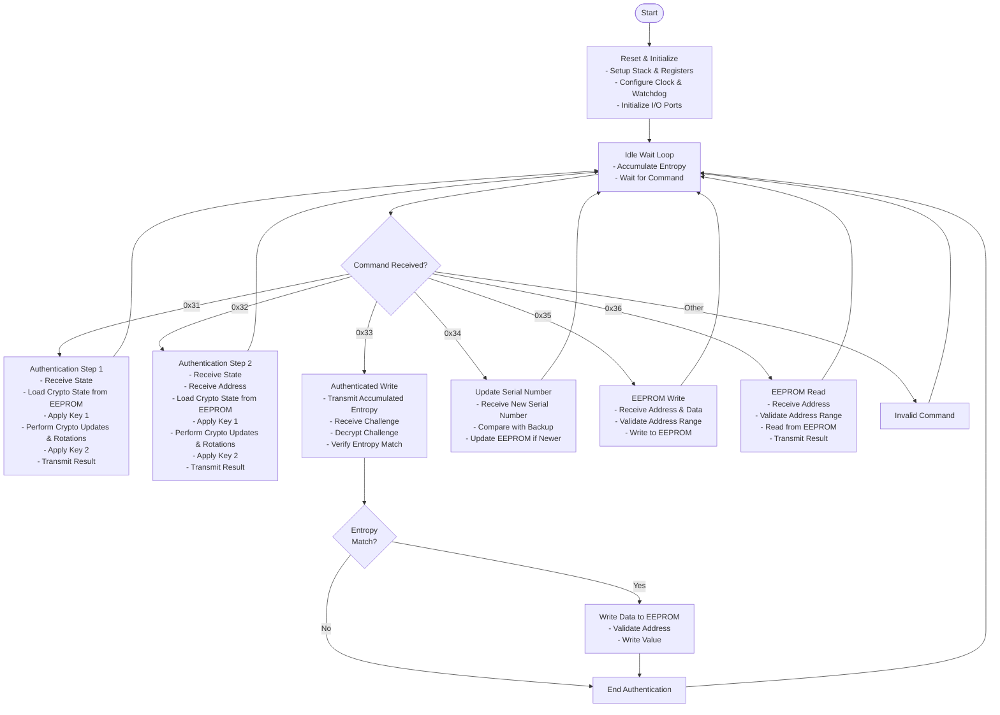

# ZLK Firmware

## Control Flow Diagram

## Overview

This AVR assembly firmware implements a authentication and write-protected memory access system with the following features:

- **Two-Stage Authentication**: Commands 0x31 and 0x32 provide two-stage cryptographic authentication
- **Authenticated Write**: Command 0x33 enables write access only after successful entropy-based authentication
- **Serial Number Management**: Command 0x34 manages versioned serial numbers with backup
- **EEPROM Access**: Commands 0x35 and 0x36 allow direct EEPROM read/write within protected address ranges
- **Cryptographic Operations**: Custom LCG-based crypto with state rotations and key application
- **Entropy Accumulation**: Continuous entropy collection for authentication challenges
